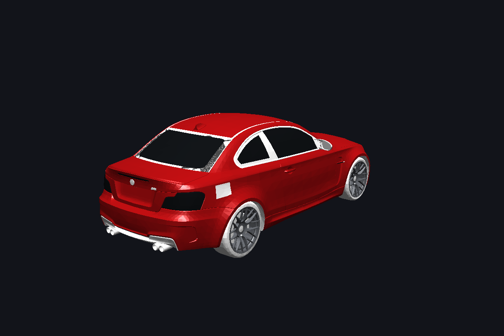

# CarGame — Stage 1

A driving game built in **Godot 4.3**. Third person, rear chase camera, a real
BMW 1M model, and a vehicle simulation where everything that moves the car comes
out of the physics rather than being scripted.

Stage 1 delivers the car itself: the model, the two wheel animations, and the
full suspension / tyre / drivetrain simulation, on a flat 200 x 200 m test
ground. Forests, mountains and cities come in the later stages.



---

## Running it

1. Open Godot **4.3**.
2. Import this folder (`project.godot`).
3. Press **F5**.

The car spawns 0.68 m above the ground, drops, compresses the springs by about
7 cm, bounces once and settles — exactly the drop test the simulation is tuned
around.

### Controls

| Key | Action |
| --- | --- |
| `W` / `↑` | throttle |
| `S` / `↓` | brake (hold at a standstill to select reverse) |
| `A` `D` / `←` `→` | steer |
| `Space` | handbrake |
| `C` | cycle camera (chase → hood → orbit) |
| `R` | respawn |
| `~` | physics telemetry overlay |

---

## The two animations

Both animations are **read-outs of the simulation**, not timed clips. There is
no AnimationPlayer anywhere in the project, because a canned animation would
desynchronise from the physics the moment a wheel locks, spins or leaves the
ground.

### 1. Wheel rotation

Each wheel is a rotational body with its own inertia
(`I = ½ m r²`, ~1.1 kg·m² per wheel). Every physics tick it integrates:

```
I · dω/dt  =  T_drive  −  F_x · r  −  T_brake
```

* `T_drive` — engine torque through the gearbox, final drive and LSD
* `F_x · r` — the reaction from the contact patch, which is what actually
  accelerates the car
* `T_brake` — brake torque, solved implicitly so a wheel can lock but never
  spin backwards from braking alone

The mesh is then rotated by `ω · Δt` around its local X axis in `_process()`,
so the visual stays smooth even though physics runs at a fixed 120 Hz.

Because the spin is a physical quantity, everything falls out for free: the
wheels lock under heavy braking, spin up when you get greedy with the throttle
in first gear, and keep turning while the car is airborne.

Verified: at 111 km/h the wheels turn at 14.87 rev/s and the contact patch
speed matches the true road speed to within **0.06%** — the tyres are rolling,
not skating.

### 2. Steering

The front `RayCast3D` nodes are yawed directly, and the wheel meshes are their
children, so the steering animation and the steering *physics* are the same
transform. There is no way for them to disagree.

The rack models:

* **Ackermann geometry** — the inner wheel turns through a bigger angle than
  the outer one, because it follows a tighter radius around the same turn
  centre. At full lock: inner 36.9°, outer 29.9°.
* **Speed sensitive ratio** — lock is scaled from 37° at a standstill down to
  ~12° at motorway speed, so the car is manoeuvrable when parking and calm at
  speed.
* **Rack rate limiting** — the virtual rack takes time to move, and moves more
  slowly the faster you go.
* **Static toe and camber** — baked into each corner (−1.4° front, −1.9° rear
  camber) and applied to the mesh.

The steering wheel inside the cockpit turns with the front wheels. Its column
rake (22.5°) is baked into the glTF node by the converter, so the game only has
to spin the mesh around its own axis.

---

## The physics

`RigidBody3D` chassis + four raycast corners. Godot's built-in `VehicleBody3D`
is explicitly documented as *"not designed to provide realistic 3D vehicle
physics"*, so this is a full custom model.

### Suspension — `scripts/wheel.gd`

Each corner is a coil-over with:

| Element | Value | Why |
| --- | --- | --- |
| Spring rate | 52 800 N/m front, 53 500 N/m rear | gives ~1.85 Hz front / 1.95 Hz rear ride frequency, the range road cars actually use |
| Bump damping | 3 090 / 2 970 Ns/m | ≈ 0.34 of critical |
| Rebound damping | 5 270 / 5 070 Ns/m | ≈ 0.58 of critical — rebound is always stiffer than bump on a real damper |
| Travel | 160 mm | with 75 mm of static sag |
| Bump stops | 1.2 MN/m over the last 45 mm | progressive microcellular rubber |
| Anti-roll bars | 14 000 / 9 500 N/m | front-biased, which is what makes the car turn in without snapping |

The damper is **digressive**: full rate up to a knee speed of 0.18 m/s, then a
reduced slope, so kerbs and potholes don't spike the force.

Critically, the **tyre carcass is modelled as a second spring in series**
(260 kN/m radial, heavily damped for rubber hysteresis). Without it, a hard
landing bottoms the coil out and the chassis punches through the floor — this
was a real bug caught by the drop test and fixed.

### Tyres

A normalised **Pacejka magic formula** with a friction ellipse for combined
slip:

```
μ(s) = sin( C · atan( B·s − E·(B·s − atan(B·s)) ) )
```

`B = 1.685211` is solved numerically so the peak lands exactly at a normalised
slip of 1.0, which means the peak slip ratio (0.115) and peak slip angle (8–8.8°)
are the values you actually tune, in units that mean something.

On top of that:

* **Transient slip via relaxation length** (0.42 m). Slip ratio and slip angle
  are integrated as first-order lags instead of dividing by velocity, which is
  what makes the model stable from 0 km/h — the usual cause of raycast cars
  vibrating themselves apart at low speed.
* **Load sensitivity** — μ drops as vertical load rises, so a tyre carrying
  twice the load makes less than twice the grip. This is what produces real
  load-transfer behaviour instead of a car that corners on rails.
* **Friction ellipse** — throttle eats into cornering grip and vice versa; you
  cannot brake and turn at 100% simultaneously.
* **Torque limiting** — a tyre can never generate more force than the drive or
  brake torque applied to it, so grip is never created out of nothing.
* Rolling resistance that grows with the square of speed.

### Drivetrain

Turbocharged straight-six torque curve (450 Nm plateau from 3 000 to 5 900 rpm),
six-speed gearbox with real 1M ratios, 3.15 final drive, automatic shifting with
a 0.22 s clutch-open window, and a **limited slip differential** that biases
torque to the slower wheel and hands the full load to whichever wheel is still
on the ground.

The clutch slips towards open below 2.2 m/s so the engine can idle at rest —
without that, a car parked in gear creeps forever on idle torque (another real
bug the tests caught).

### Weight transfer

Every force is applied at its real world position — spring forces at the contact
patch, aero at the axles — so pitch under braking, squat under power and roll in
corners all emerge from the rigid body solver. The inertia tensor is built from
the car's real dimensions rather than auto-computed from the collision hulls.

### Collisions

The body is a **9-slab convex decomposition** of the car's outer shell, computed
from the mesh by the converter. Interior geometry (seats, dashboard, belts) is
excluded, so the hulls hug the actual bodywork. The lowest point sits at 136 mm,
matching the real ride height.

Physics runs at **120 Hz** with 32 solver iterations and continuous collision
detection.

---

## Verification

Godot cannot be launched in every environment, so the physics is verified
offline: `tools/sim_check.py` re-implements the exact maths from the GDScript in
Python and integrates it with a rigid body solver that behaves like Godot's.

```
$ python3 tools/sim_check.py
== drop test: spawn 0.68 m above the ground ==
  touchdown at 0.17 s, lowest -0.071 m, rebound 0.047 m, settled 0.002 m
  peak load 114122 N (7.78 g), settled load 14666 N (static 14666 N)
  static corner loads: front 3527 N  rear 3806 N  -> 48.1% front
== acceleration ==      0-100 km/h 5.80 s, top speed 279 km/h
== braking ==           100-0 km/h in 35.5 m (1.11 g)
== cornering ==         1.25 g lateral, 3.0 deg of body roll
ALL CHECKS PASSED
```

Those numbers are all in the right ballpark for a real BMW 1M (4.9 s claimed
0–100, ~36 m braking, ~1.0 g on road tyres).

| Script | Checks |
| --- | --- |
| `tools/sim_check.py` | drop, settling, static loads, weight distribution, acceleration, braking, cornering, 30 s parked stability |
| `tools/anim_check.py` | wheel roll matches ground speed, Ackermann, speed sensitive lock, airborne coasting, pivot geometry |
| `tools/camera_check.py` | camera never clips inside the car, view direction never degenerate, rig wiring |
| `tools/project_check.py` | scene resource integrity, glTF validity, input map, node paths |

Run all four:

```bash
python3 tools/sim_check.py && python3 tools/anim_check.py \
  && python3 tools/camera_check.py && python3 tools/project_check.py
```

---

## The model

The source asset is an Assetto Corsa BMW 1M FBX (22 MB, 210 nodes, 40 materials,
no rig and no animations). `tools/fbx_to_gltf.py` is a dependency-free FBX
parser and glTF writer that:

* converts centimetres to metres and rotates the model so it faces Godot's −Z
* **groups the 210 nodes into the 10 the game animates** — `body`, `steering`,
  and `hub_`/`wheel_` for each corner — merging meshes per material
* places each group's pivot on the real hub centre from the FBX, so the wheels
  rotate around their true axes
* bakes the steering column rake into the steering node
* rebuilds PBR materials from the FBX Blinn-Phong parameters (converting
  specular exponent to roughness) with hand-tuned overrides for paint, glass,
  chrome, rubber and brake discs
* repairs the handful of zero-length normals and drops the zero-area triangles
  present in the source asset (Godot warns about these during LOD generation)
* generates the convex collision decomposition

Result: **22 MB FBX → 3.3 MB glTF**, 100 605 triangles, wheelbase 2.632 m and
track 1.489 m — matching the real car.

To re-run it:

```bash
python3 tools/fbx_to_gltf.py "source/bmw_1m final.fbx" textures/ assets/car/
python3 tools/build_car_scene.py assets/car scenes/car.tscn
```

---

## Layout

```
assets/car/         bmw_1m.gltf + .bin + 44 textures + collision data
scenes/main.tscn    world, sun, sky, camera, HUD
scenes/car.tscn     generated: chassis, 9 collision hulls, 4 corners
scripts/wheel.gd    suspension + tyre model + wheel dynamics
scripts/vehicle.gd  chassis, engine, gearbox, LSD, steering, aero
scripts/car_model.gd  wires the glTF parts to the physics corners
scripts/chase_camera.gd, hud.gd, world.gd
tools/              converter, scene generator, three verification suites
```

---

## Credits

* Car model: BMW 1M, Assetto Corsa community asset (Sketchfab).
* Tyre model based on H. B. Pacejka, *Tyre and Vehicle Dynamics*.
* Suspension layout informed by
  [Godot Easy Vehicle Physics](https://github.com/DAShoe1/Godot-Easy-Vehicle-Physics)
  and [Godot Advanced Vehicle](https://github.com/Dechode/Godot-Advanced-Vehicle).
